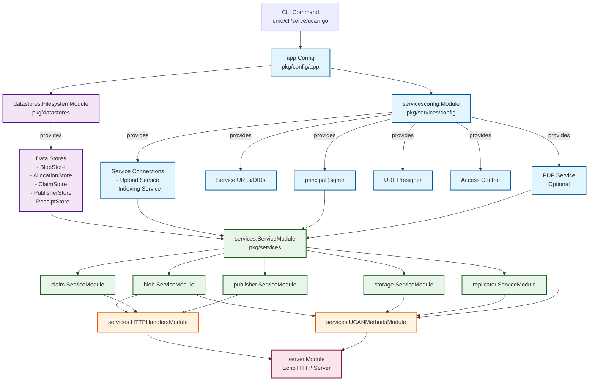

# Storage Service Architecture

## Fx Module Dependency Diagram

## Module Breakdown

### 1. **Configuration Layer**
- **Input**: `app.Config` (transformed from CLI flags/config file)
- **Modules**:
  - `servicesconfig.Module` - Provides configuration-derived dependencies
  - `datastores.FilesystemModule` - Provides data storage implementations

### 2. **Core Dependencies** (What gets provided)
From `servicesconfig.Module`:
- `principal.Signer` - Service identity
- Service connections (Upload, Indexing)
- Service URLs and DIDs
- PDP Service (optional)
- URL presigner for blob access
- Access control patterns

From `datastores.FilesystemModule`:
- `BlobStore` - Binary data storage
- `AllocationStore` - Space allocations
- `ClaimStore` - UCAN delegations
- `PublisherStore` - IPNI publishing state
- `ReceiptStore` - Task receipts

### 3. **Service Layer**
`services.ServiceModule` contains:
- `blob.ServiceModule` - Blob storage logic
- `claim.ServiceModule` - Claim/delegation management
- `publisher.ServiceModule` - IPNI publishing
- `storage.ServiceModule` - Storage orchestration
- `replicator.ServiceModule` - Replication logic

### 4. **API Layer**
- `services.HTTPHandlersModule` - REST/HTTP endpoints
- `services.UCANMethodsModule` - UCAN-based RPC handlers

### 5. **Server Layer**
- `server.Module` - Echo HTTP server with middleware

## Dependency Flow

1. **Config Transformation**: CLI flags → `app.Config`
2. **Dependency Creation**: `app.Config` → Config providers + Datastore providers
3. **Service Creation**: Dependencies → Service implementations
4. **API Registration**: Services → HTTP/UCAN handlers
5. **Server Start**: Handlers → Echo server

## Key Design Principles

1. **Separation of Concerns**: Each module has a single responsibility
2. **Explicit Dependencies**: No hidden dependencies between modules
3. **Layered Architecture**: Clear layers from config → storage → services → API
4. **Testability**: Each layer can be tested independently
5. **Flexibility**: Modules can be swapped (e.g., filesystem → AWS datastores)