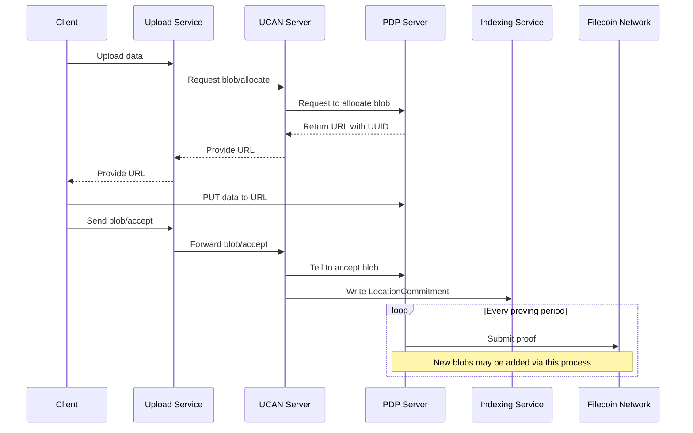

# Piri Architecture Overview

This document explains the architecture of the Piri storage system and how its components interact.

## System Components

### 1. PDP (Proof of Data Possession) Server

The PDP server is responsible for:
- **Data Storage**: Stores actual data pieces submitted by clients
- **Proof Generation**: Generates cryptographic proofs that demonstrate possession of stored data
- **Contract Interaction**: Interacts with on-chain smart contracts to submit proofs
- **Piece Management**: Manages the lifecycle of stored pieces

**Implementations:**
- **Piri PDP Server**: This project's implementation
- **Curio**: Filecoin's implementation (formerly Lotus-Miner)

### 2. UCAN (User Controlled Authorization Network) Server

The UCAN server is responsible for:
- **Client Interface**: Accepts data uploads from Storacha network clients
- **Authentication**: Handles delegated authorization via UCAN tokens
- **Aggregation**: Aggregates data uploads into appropriately sized pieces for PDP operations
- **Data Routing**: Routes pieces to the configured PDP backend
- **Delegation Management**: Manages authorization delegations from the Storacha network

### 3. Key Relationships

```
┌──────────────────┐
│ Storacha Network │
└────────┬─────────┘
         │ HTTPS + UCAN Auth
         ▼
┌─────────────────┐      ┌──────────────────┐
│  UCAN Server    │─────▶│   PDP Server     │
│   (Piri)        │ API  │ (Piri or Curio)  │
└─────────────────┘      └─────────┬────────┘
                                   │
                                   ▼
                         ┌──────────────────┐
                         │ Filecoin Network │
                         │  (PDP Contract)  │
                         └──────────────────┘
```

## Data Flow

### Upload Flow



### Retrieval Flow

TODO: Document the retrieval architecture with Mermaid diagram

## Configuration Relationships

### Shared service.pem File

The `service.pem` file contains the cryptographic identity for your storage provider:
- **Used by UCAN Server**: For authentication and signing operations
- **Used by Piri PDP Server**: For identity and contract interactions
- **Used with Curio**: Public key portion must be registered as a service

```
┌─────────────┐
│ service.pem │
│  (Ed25519)  │
└──────┬──────┘
       │
       ├─────────────┐
       │             │
       ▼             ▼
┌─────────────┐ ┌─────────────┐
│ UCAN Server │ │ PDP Server  │
└─────────────┘ └─────────────┘
```

### Domain Requirements

- **PDP Server Domain/Subdomain**: Required by UCAN server to communicate with PDP backend.
- **UCAN Server Domain/Subdomain**: Required for client connections and Storacha Network registration.

## Deployment Patterns

### 1. Full Piri Stack

Single operator runs both services:

```
Internet ──HTTPS──▶ Nginx ──HTTP──▶ UCAN Server ──HTTPS──▶ PDP Server
                     │                                           │
                     └───────────────── Same Host ───────────────┘
```

**Use Case:** New storage providers starting fresh

### 2. Piri UCAN + Curio PDP

Hybrid deployment using existing Filecoin infrastructure:

```
Internet ──HTTPS──▶ UCAN Server ──HTTPS──▶ Curio Instance
                    (Piri)                  (Existing SP)
```

**Use Case:** Existing Filecoin storage providers

## Security Architecture

### Authentication Flow

```
Storacha ──UCAN Token──▶ UCAN Server
                           │
                           ▼
                    Validate Token
                           │
                           ▼
                    Check Delegation
                           │
                           ▼
                    Sign PDP Request ──▶ PDP Server
```

## Network Architecture

### Port Requirements

```
┌──────────────┐
│   Internet   │
└──────┬───────┘
       │ :443 (HTTPS)
┌──────▼───────┐
│ Load Balancer│
│   / Nginx    │
└──────┬───────┘
       │ :3000 (HTTP)
┌──────▼───────┐         ┌─────────────┐
│ UCAN Server  │────────▶│ PDP Server  │
└──────────────┘ :3001   └─────────────┘
```