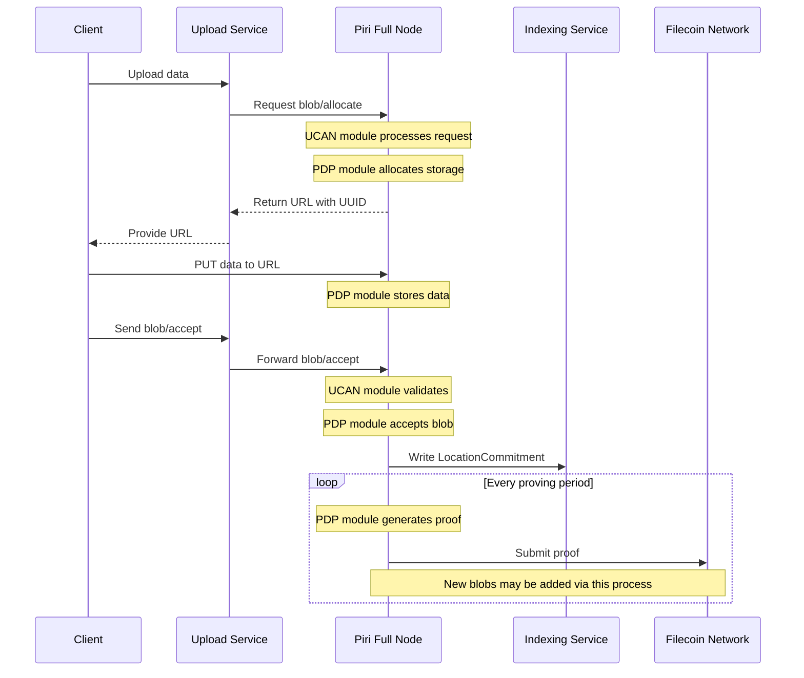

# Piri Architecture Overview

This document explains the architecture of the Piri storage system and how its components interact.

## System Components

### Single-Process Architecture

Piri now runs as a unified single process (`piri serve full`) that combines both UCAN and PDP functionality:

#### UCAN Module
The UCAN module within Piri is responsible for:
- **Client Interface**: Accepts data uploads from Storacha network clients
- **Authentication**: Handles delegated authorization via UCAN tokens
- **Aggregation**: Aggregates data uploads into appropriately sized pieces for storage operations
- **Delegation Management**: Manages authorization delegations from the Storacha network

#### PDP Module  
The PDP module within Piri is responsible for:
- **Data Storage**: Stores actual data pieces submitted by clients
- **Proof Generation**: Generates cryptographic proofs that demonstrate possession of stored data
- **Contract Interaction**: Interacts with on-chain smart contracts to submit proofs
- **Piece Management**: Manages the lifecycle of stored pieces

**Alternative PDP Implementations:**
- **Piri (Integrated)**: Default integrated PDP module
- **Curio**: External Filecoin implementation (formerly Lotus-Miner) - can be used as external PDP backend

### 3. Key Relationships

```
┌──────────────────┐
│ Storacha Network │
└────────┬─────────┘
         │ HTTPS + UCAN Auth
         ▼
┌─────────────────────────────────┐
│        Piri Full Node           │
│  ┌─────────────┬─────────────┐  │
│  │ UCAN Module │ PDP Module  │  │
│  └─────────────┴──────┬──────┘  │
└───────────────────────┼─────────┘
                        │
                        ▼
              ┌──────────────────┐
              │ Filecoin Network │
              │  (PDP Contract)  │
              └──────────────────┘

Alternative with External PDP:
┌──────────────────┐
│ Storacha Network │
└────────┬─────────┘
         │ HTTPS + UCAN Auth
         ▼
┌─────────────────┐      ┌──────────────────┐
│  Piri Full Node │─────▶│ External PDP     │
│  (UCAN Only)    │ API  │    (Curio)       │
└─────────────────┘      └─────────┬────────┘
                                   │
                                   ▼
                         ┌──────────────────┐
                         │ Filecoin Network │
                         │  (PDP Contract)  │
                         └──────────────────┘
```

## Data Flow

### Upload Flow



### Retrieval Flow

TODO: Document the retrieval architecture with Mermaid diagram

## Configuration Relationships

### Configuration Management

Piri uses a unified configuration system:

1. **Initial Setup**: `piri init` command generates a complete TOML configuration file
2. **Runtime**: `piri serve full` uses the generated config file or accepts configuration via flags/environment variables

### service.pem Identity File

The `service.pem` file contains the cryptographic identity for your storage provider:
- **Used by Piri**: For authentication, signing operations, and contract interactions
- **Used with External Curio**: Public key portion must be registered as a service

```
┌─────────────┐
│ service.pem │
│  (Ed25519)  │
└──────┬──────┘
       │
       ▼
┌─────────────────────┐
│   Piri Full Node    │
│  ┌───────────────┐  │
│  │ Both Modules  │  │
│  └───────────────┘  │
└─────────────────────┘
```

### Domain Requirements

- **Single Public Domain**: Required for client connections and Storacha Network registration (e.g., `piri.example.com`)
- **Internal PDP URL** (Optional): Only needed if using an external PDP backend like Curio

## Deployment Patterns

### 1. Integrated Piri Full Node (Recommended)

Single process handles all functionality:

```
Internet ──HTTPS──▶ Nginx ──HTTP──▶ Piri Full Node
                                    (UCAN + PDP)
```

**Use Case:** Most deployments, both new and existing storage providers

### 2. Piri + External Curio PDP

Hybrid deployment using existing Filecoin infrastructure:

```
Internet ──HTTPS──▶ Piri Full Node ──HTTPS──▶ Curio Instance
                    (UCAN only)                (External PDP)
```

**Use Case:** Storage providers with existing Curio infrastructure

## Security Architecture

### Authentication Flow

```
Storacha ──UCAN Token──▶ Piri Full Node
                           │
                           ▼
                    UCAN Module:
                    Validate Token
                           │
                           ▼
                    Check Delegation
                           │
                           ▼
                    PDP Module:
                    Process Request
```

## Network Architecture

### Port Requirements

```
┌──────────────┐
│   Internet   │
└──────┬───────┘
       │ :443 (HTTPS)
┌──────▼───────┐
│ Load Balancer│
│   / Nginx    │
└──────┬───────┘
       │ :3000 (HTTP)
┌──────▼───────┐
│ Piri Full    │
│    Node      │
└──────────────┘
```

**Single Port Operation:**
- Port 3000: Piri Full Node (handles both UCAN and PDP operations)
- Port 443: Public HTTPS endpoint via reverse proxy