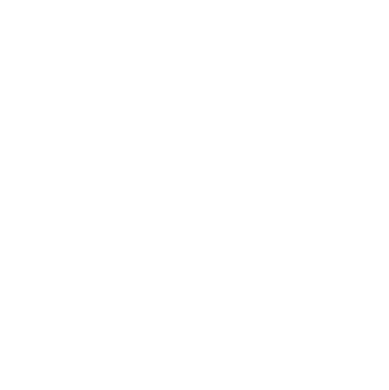

# Getting Started with Piri

This guide covers both the **Forge Production** and **Forge Staging** networks. The setup steps are identical except for two values. Use the **Environment** dropdown in the header to toggle the values shown below (defaults to Production).

  

    
  

  

    
Getting Started with Piri

    
Pick your environment (<strong>Production</strong> or <strong>Staging</strong>) and deploy with the right flags.

  

## Complete Setup Guide

  <a class="step-card" href="./setup/prerequisites">
    
    Step 1 Prerequisites
    Set up your system, network, and Filecoin node.
  </a>
  <a class="step-card" href="./setup/installation">
    
    Step 2 Install Piri
    Download and install the Piri binary.
  </a>
  <a class="step-card" href="./setup/key-generation">
    
    Step 3 Generate Keys
    Create your identity key and wallet.
  </a>
  <a class="step-card" href="./setup/tls-termination">
    
    Step 4 Configure TLS
    Set up secure connections (HTTPS) for your domain.
  </a>
  <a class="step-card" href="./setup/piri-server">
    
    Step 5 Setup Piri Node
    Set up and run your Piri node with environment-aware flags.
  </a>

---

After following this guide, you will have Piri running and ready to work with the Storacha network.
