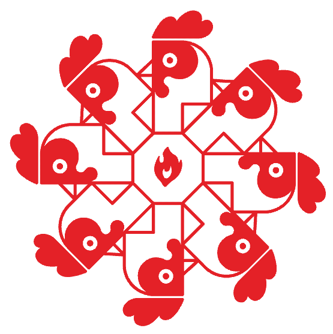

# Getting Started with Piri

This guide covers both the **Forge Production** and **Forge Staging** networks. The setup steps are identical except for two values. Use the **Environment** dropdown in the header to toggle the values shown below (defaults to Production).

  

    
  

  

    
Getting Started with Piri

    
Pick your environment (Production/Staging) and deploy with the right flags.

  

## Complete Setup Guide

<ul class="step-card-grid">
  <li class="step-card" markdown="1">
    

    
Step 1: <a href="./setup/prerequisites">Prerequisites</a>

    
Set up your system, network, and Filecoin node.

  </li>
  <li class="step-card" markdown="1">
    

    
Step 2: <a href="./setup/installation">Install Piri</a>

    
Download and install the Piri binary.

  </li>
  <li class="step-card" markdown="1">
    

    
Step 3: <a href="./setup/key-generation">Generate Keys</a>

    
Create your identity key and wallet.

  </li>
  <li class="step-card" markdown="1">
    

    
Step 4: <a href="./setup/tls-termination">Configure TLS</a>

    
Set up secure connections (HTTPS) for your domain.

  </li>
  <li class="step-card" markdown="1">
    

    
Step 5: <a href="./setup/piri-server">Setup Piri Node</a>

    
Set up and run your Piri node with environment-aware flags.

  </li>
</ul>

---

After following this guide, you will have Piri running and ready to work with the Storacha network.
