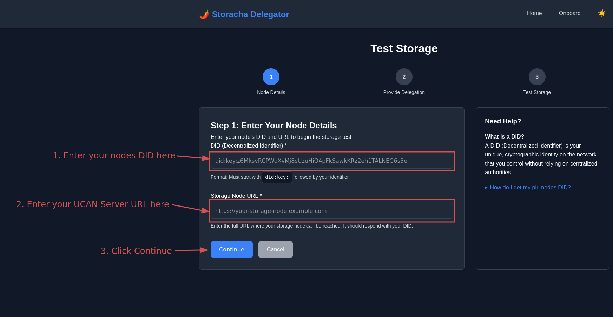
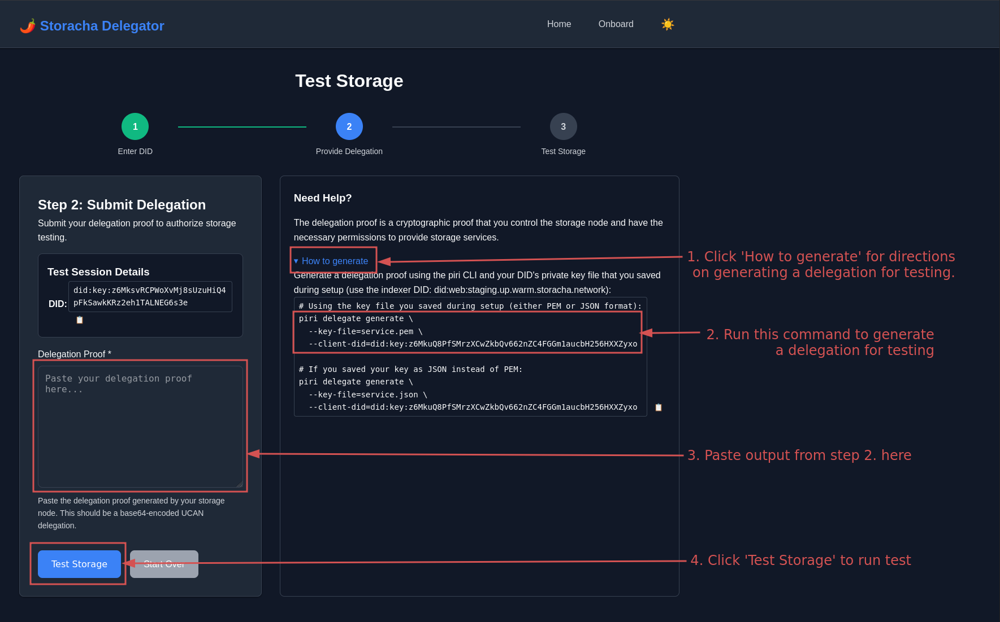

# Validate Your Piri Setup

You are now running a Piri node!

## Prerequisites

Before testing, make sure you have:
- ✅ [Set up your Piri Node](../guides/piri-server.md)

## Validation Steps

### 1. Test Data Reception

Go to https://staging.delegator.storacha.network/test-storage to test your setup. There are three main steps:

#### Step 1: Enter Your Node Details



1. **Enter your node's DID**: 
   - Must start with `did:key:` followed by your ID
   - Example: `did:key:z6MksyRCPWoXvMj8sUzuHiQ4pFkSawkKRz2eh1TALNEG6s3e`

2. **Enter your Piri Node URL**:
   - The full web address where your Piri node can be reached
   - It should show your DID when visited
   - Example: `https://piri.example.com`

3. **Click Continue** to go to the next step

#### Step 2: Submit Delegation Proof



1. **Create a delegation proof**:
   - Click "How to generate" for instructions
   - Use the piri command shown on the page:
   ```bash
   # Use the service.pem file you saved during setup:
   piri delegate generate \
     --key-file=service.pem \
     --client-did=did:key:z6MkuQ8PfSMrzXCwZkbQv662nZC4FGGm1aucbH256HXXZyxo
   ```

2. **Paste your delegation proof**:
   - Copy what the command prints out
   - Paste it into the "Delegation Proof" box

3. **Click "Test Storage"** to run the test

If it works, you'll see a message that your Piri setup is getting data from the Storacha Network correctly.

### 2. Inspect Your Proof Set

After testing works, you can check your proof sets by going to the [PDPscan Proof Set Inspector](inspect-proof-set.md).

---

Great work! Your Piri setup is done and ready to get data from the Storacha Network.