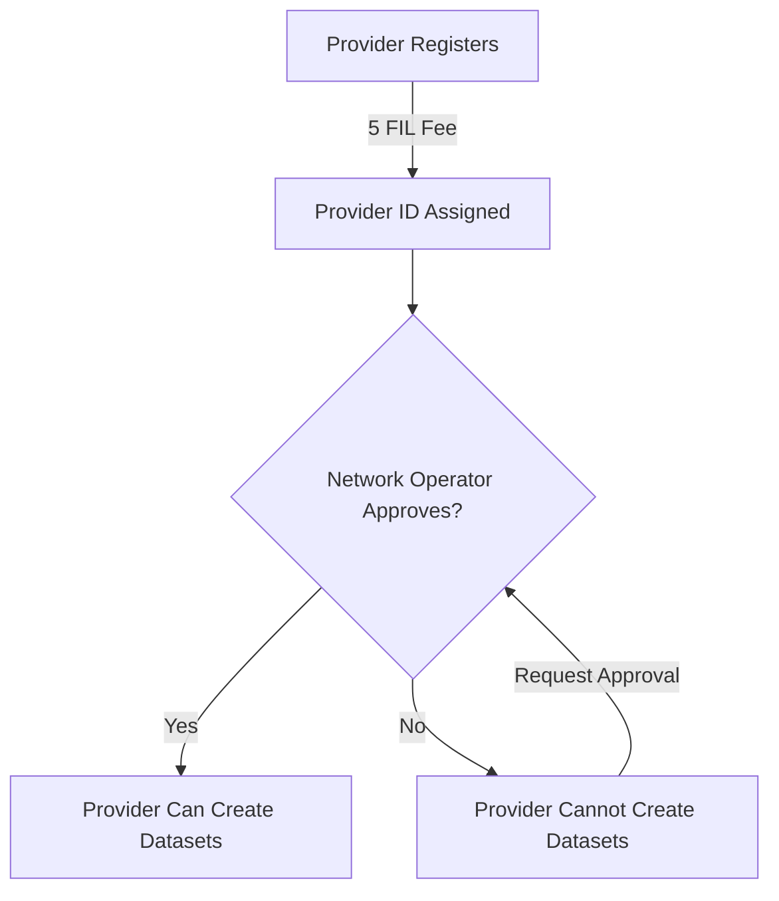

# Provider Approval Guide for Network Operators

This guide explains the two-step process for service providers to participate in the FilecoinWarmStorageService: registration and approval.

## Overview

The FilecoinWarmStorageService uses a two-tier access control model:

1. **Registration (Permissionless)**: Providers self-register on ServiceProviderRegistry by paying 5 FIL
2. **Approval (Permissioned)**: Contract owner approves registered providers to create and manage datasets

This creates a curated list of trusted providers while maintaining an economic barrier against spam.

## Two-Step Process



## Step 1: Provider Registration

Providers register using the `piri` CLI:

```bash
# Register as a service provider
piri pdp provider register \
  --name "My Storage Provider" \
  --description "A storage services"
```

**Cost:** 5 FIL registration fee (paid to ServiceProviderRegistry)

**Output:** Provider ID assigned by the registry. Note this ID for the approval step.

See [SERVICE_PROVIDER_REGISTRY_GUIDE.md](./SERVICE_PROVIDER_REGISTRY_GUIDE.md) for additional details.

## Step 2: Provider Approval

### For Network Operators

Approve registered providers using the `service-operator` CLI:

```bash
# Approve a provider by their ID
service-operator provider approve <provider-id>
```

**Requirements:**
- Must be contract owner
- Sufficient FIL for gas

**Effect:**
- Adds provider ID to approved list
- Emits `ProviderApproved` event
- Provider can now create datasets

### For Service Providers

After registering:

1. Contact the network operator with your provider ID and service documentation
2. Wait for approval
3. Once approved, you can create datasets through the FilecoinWarmStorageService

## Managing Providers

### Listing Registered Providers

View all registered providers with approval status:

```bash
service-operator provider list \
  --rpc-url https://api.calibration.node.glif.io/rpc/v1 \
  --contract-address 0x8b7aa0a68f5717e400F1C4D37F7a28f84f76dF91 \
  --format table \
  --limit 100
```

**Options:**
- `--format table|json` - Output format
- `--limit <n>` - Max providers to display (default: 50)
- `--offset <n>` - Pagination offset
- `--show-inactive` - Include inactive providers
- `--contract-address` - FilecoinWarmStorageService address (required for approval status)

**Note:** Read-only operation; no credentials required. The `--contract-address` flag is optional but recommended to display provider approval status.

**Example output:**
```
ID  Address                                     Payee                                       Name     Description      Active  Approved
-----------------------------------------------------------------------------------------------------------------------------------------
1   0x7469B47e006D0660aB92AE560b27A1075EEcF97F  0x7469B47e006D0660aB92AE560b27A1075EEcF97F  forrest  forrest testing  ✓       ✓

Showing 1 provider(s)
```

## Workflow Summary

### For Network Operators

1. **List registered providers with approval status:**
   ```bash
   service-operator provider list \
     --contract-address 0x8b7aa0a68f5717e400F1C4D37F7a28f84f76dF91 \
     --format table
   ```

2. **Approve a provider:**
   ```bash
   service-operator provider approve <provider-id>
   ```

3. **Verify approval** by running `provider list` again to see the updated "Approved" column

### For Service Providers

1. **Register:**
   ```bash
   piri pdp provider register --name "..." --description "..."
   ```

2. **Contact network operator** with your provider ID

3. **Wait for approval** (monitor `ProviderApproved` events)

4. **Create datasets** once approved

## References

- [service-operator README](./README.md) - Full CLI documentation
- [SERVICE_PROVIDER_REGISTRY_GUIDE.md](./SERVICE_PROVIDER_REGISTRY_GUIDE.md) - Registration details
- Contract: `FilecoinWarmStorageService.sol` - Lines 482-514 for approval functions