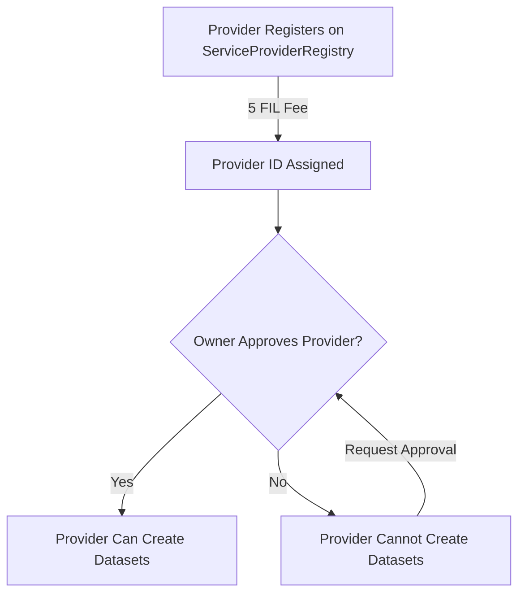

# Provider Approval Guide for FilecoinWarmStorageService

This guide explains the two-step process for service providers to participate in the FilecoinWarmStorageService: registration and approval.

## Table of Contents
- [Overview](#overview)
- [The Two-Step Process](#the-two-step-process)
- [Step 1: Provider Registration](#step-1-provider-registration)
- [Step 2: Provider Approval](#step-2-provider-approval)
- [Managing Approved Providers](#managing-approved-providers)
- [Checking Approval Status](#checking-approval-status)
- [Code Examples](#code-examples)
- [Common Scenarios](#common-scenarios)

## Overview

While the ServiceProviderRegistry allows **permissionless self-registration**, the FilecoinWarmStorageService adds an additional **approval layer** controlled by the contract owner. This creates a curated list of trusted providers who can create and manage datasets.

### Why Two Steps?

1. **Registration (Permissionless)**: Anyone can register by paying 5 FIL, creating an economic barrier against spam
2. **Approval (Permissioned)**: Contract owner vets providers before they can handle client data, ensuring quality and trust

## The Two-Step Process



## Step 1: Provider Registration

First, providers must register on the ServiceProviderRegistry (see [SERVICE_PROVIDER_REGISTRY_GUIDE.md](./SERVICE_PROVIDER_REGISTRY_GUIDE.md) for details):

```bash
# Register with 5 FIL fee
cast send $REGISTRY_ADDRESS \
  "registerProvider(address,string,string,uint8,bytes,string[],string[])" \
  $PAYEE_ADDRESS \
  "Provider Name" \
  "Provider Description" \
  0 \
  $PRODUCT_DATA \
  '[]' \
  '[]' \
  --value 5ether \
  --keystore $KEYSTORE \
  --password $PASSWORD \
  --rpc-url $RPC_URL
```

After registration, note your **Provider ID** - you'll need this for the approval step.

## Step 2: Provider Approval

### For Service Providers

After registering, you need to:

1. **Contact the FilecoinWarmStorageService owner** with:
   - Your provider ID
   - Your service provider address
   - Documentation about your services
   - Any compliance/security certifications

2. **Wait for approval** - The owner will review and approve qualified providers

3. **Verify your approval status** (see [Checking Approval Status](#checking-approval-status))

### For Contract Owners

The FilecoinWarmStorageService owner manages the approved provider list using these functions:

#### Add an Approved Provider

```solidity
function addApprovedProvider(uint256 providerId) external onlyOwner
```

```bash
# Approve a provider by their ID
cast send $WARM_STORAGE_SERVICE_ADDRESS \
  "addApprovedProvider(uint256)" \
  $PROVIDER_ID \
  --keystore $OWNER_KEYSTORE \
  --password $PASSWORD \
  --rpc-url $RPC_URL
```

This will:
- Add the provider ID to the approved list
- Emit a `ProviderApproved` event
- Allow the provider to create datasets

#### Remove an Approved Provider

```solidity
function removeApprovedProvider(uint256 providerId, uint256 index) external onlyOwner
```

To remove a provider, you need both the provider ID and its index in the `approvedProviderIds` array:

```bash
# First, find the provider's index (off-chain)
# Then remove the provider
cast send $WARM_STORAGE_SERVICE_ADDRESS \
  "removeApprovedProvider(uint256,uint256)" \
  $PROVIDER_ID \
  $INDEX \
  --keystore $OWNER_KEYSTORE \
  --password $PASSWORD \
  --rpc-url $RPC_URL
```

This will:
- Remove the provider from the approved list
- Emit a `ProviderUnapproved` event
- Prevent the provider from creating new datasets (existing datasets continue)

## Managing Approved Providers

### Listing All Registered Providers

To list all providers registered on the ServiceProviderRegistry (regardless of approval status), we've created helper scripts due to cast's limitations with complex return types:

#### Quick Commands

```bash
# Set your registry address
REGISTRY_ADDRESS="0xc24a73E536979827aa516A68cb279a5092deEA3a"  # Calibnet
RPC_URL="https://api.calibration.node.glif.io/rpc/v1"

# Get total number of providers
cast call $REGISTRY_ADDRESS "getProviderCount()" --rpc-url $RPC_URL | cast --to-dec

# Check if a specific address is registered
cast call $REGISTRY_ADDRESS \
  "getProviderIdByAddress(address)(uint256)" \
  <PROVIDER_ADDRESS> \
  --rpc-url $RPC_URL | cast --to-dec

# Get basic info for a specific provider ID
cast call $REGISTRY_ADDRESS \
  "providers(uint256)" \
  <PROVIDER_ID> \
  --rpc-url $RPC_URL
```

#### Using Helper Scripts

Due to cast's limitations with decoding complex types (arrays and nested tuples), we've provided helper scripts:

1. **Basic bash script** (`query_providers_simple.sh`):
```bash
./query_providers_simple.sh
```

2. **Python decoder** (`decode_providers.py`) - Properly decodes all data:
```bash
python3 decode_providers.py
```

3. **Comprehensive bash script** (`list_providers.sh`):
```bash
./list_providers.sh
```

#### Manual Provider Discovery

Since `getAllActiveProviders` returns complex types that are difficult to decode with cast alone, you can manually scan for providers:

```bash
# Check first 10 provider IDs
for i in {1..10}; do
  echo -n "Provider $i: "
  RESULT=$(cast call $REGISTRY_ADDRESS "providers(uint256)" $i --rpc-url $RPC_URL 2>/dev/null)
  if [ -n "$RESULT" ] && [ "$RESULT" != "0x" ]; then
    echo "Found"
  else
    echo "Empty"
  fi
done
```

### Getting the Approved Provider List

To get all approved provider IDs, you'll need to read the contract storage directly or listen to events:

```javascript
// Using ethers.js to get approved providers from events
async function getApprovedProviders(contract, fromBlock = 0) {
  const approvedEvents = await contract.queryFilter(
    contract.filters.ProviderApproved(),
    fromBlock
  );
  
  const unapprovedEvents = await contract.queryFilter(
    contract.filters.ProviderUnapproved(),
    fromBlock
  );
  
  const approved = new Set();
  
  // Add all approved
  approvedEvents.forEach(event => {
    approved.add(event.args.providerId.toString());
  });
  
  // Remove unapproved
  unapprovedEvents.forEach(event => {
    approved.delete(event.args.providerId.toString());
  });
  
  return Array.from(approved);
}
```

### Finding a Provider's Index

When removing a provider, you need its index in the `approvedProviderIds` array:

```javascript
// This would require reading storage slots or maintaining an off-chain index
async function findProviderIndex(contract, providerId) {
  // Option 1: Maintain off-chain tracking of indices
  // Option 2: Try indices until you find the right one
  // Option 3: Use a getter function if available in the view contract
}
```

## Checking Approval Status

### For a Specific Provider ID

While there's no public getter in the main contract, you can:

1. **Check via failed transaction simulation**:
```javascript
// Try to simulate dataset creation - it will revert with specific error if not approved
try {
  await contract.callStatic.dataSetCreated(/* params */);
} catch (error) {
  if (error.message.includes("ProviderNotApproved")) {
    console.log("Provider not approved");
  }
}
```

2. **Monitor events**:
```bash
# Check if provider was ever approved
cast logs --address $WARM_STORAGE_SERVICE_ADDRESS \
  "ProviderApproved(uint256)" \
  --from-block 0 \
  --rpc-url $RPC_URL

# Check if provider was unapproved
cast logs --address $WARM_STORAGE_SERVICE_ADDRESS \
  "ProviderUnapproved(uint256)" \
  --from-block 0 \
  --rpc-url $RPC_URL
```

3. **Use the view contract** (if available):
Check if the deployed view contract exposes approval status.

## Code Examples

### Complete Provider Onboarding Flow

```javascript
const { ethers } = require('ethers');

async function completeProviderOnboarding(
  provider,
  registryAddress,
  warmStorageAddress,
  payeeAddress
) {
  // Step 1: Register on ServiceProviderRegistry
  const registryABI = [/* ... */];
  const registry = new ethers.Contract(registryAddress, registryABI, provider);
  
  // Prepare and register (costs 5 FIL)
  const tx = await registry.registerProvider(
    payeeAddress,
    "My Storage Service",
    "High-performance storage provider",
    0, // PDP
    productData,
    [],
    [],
    { value: ethers.utils.parseEther("5") }
  );
  
  const receipt = await tx.wait();
  const event = receipt.events.find(e => e.event === 'ProviderRegistered');
  const providerId = event.args.providerId;
  
  console.log(`Registered with Provider ID: ${providerId}`);
  console.log("Please contact the contract owner for approval with this ID");
  
  // Step 2: Wait for approval (off-chain process)
  // Monitor for ProviderApproved event
  
  const warmStorageABI = [/* ... */];
  const warmStorage = new ethers.Contract(warmStorageAddress, warmStorageABI, provider);
  
  warmStorage.on('ProviderApproved', (approvedId) => {
    if (approvedId.eq(providerId)) {
      console.log("Provider approved! You can now create datasets.");
    }
  });
}
```

### Owner: Batch Approve Providers

```javascript
async function batchApproveProviders(owner, warmStorageAddress, providerIds) {
  const warmStorageABI = [
    "function addApprovedProvider(uint256 providerId) external"
  ];
  
  const contract = new ethers.Contract(warmStorageAddress, warmStorageABI, owner);
  
  for (const providerId of providerIds) {
    try {
      const tx = await contract.addApprovedProvider(providerId);
      await tx.wait();
      console.log(`Approved provider ID: ${providerId}`);
    } catch (error) {
      if (error.message.includes("ProviderAlreadyApproved")) {
        console.log(`Provider ${providerId} already approved`);
      } else {
        console.error(`Failed to approve provider ${providerId}:`, error.message);
      }
    }
  }
}
```

### Check If Dataset Creation Will Succeed

```javascript
async function canCreateDataset(serviceProviderAddress, warmStorageAddress, registryAddress) {
  // First check if registered
  const registry = new ethers.Contract(registryAddress, registryABI, provider);
  const providerId = await registry.getProviderIdByAddress(serviceProviderAddress);
  
  if (providerId.eq(0)) {
    return { canCreate: false, reason: "Not registered on ServiceProviderRegistry" };
  }
  
  // Then simulate dataset creation to check approval
  const warmStorage = new ethers.Contract(warmStorageAddress, warmStorageABI, provider);
  
  try {
    // This is a simulation - won't actually create anything
    await warmStorage.callStatic.dataSetCreated(
      1, // dummy dataSetId
      serviceProviderAddress,
      "0x" // dummy extraData
    );
    return { canCreate: true, providerId: providerId.toString() };
  } catch (error) {
    if (error.message.includes("ProviderNotApproved")) {
      return { 
        canCreate: false, 
        reason: "Provider registered but not approved", 
        providerId: providerId.toString() 
      };
    }
    return { canCreate: false, reason: error.message };
  }
}
```

## Common Scenarios

### Scenario 1: New Provider Onboarding

1. Provider registers on ServiceProviderRegistry (5 FIL)
2. Provider submits approval request to contract owner
3. Owner reviews provider credentials
4. Owner calls `addApprovedProvider(providerId)`
5. Provider receives `ProviderApproved` event
6. Provider can now create datasets

### Scenario 2: Provider Deactivation

1. Owner identifies provider to remove
2. Owner finds provider's index in approved list
3. Owner calls `removeApprovedProvider(providerId, index)`
4. Provider receives `ProviderUnapproved` event
5. Provider cannot create new datasets
6. Existing datasets continue to function

### Scenario 3: Provider Changes Service Provider Address

When a dataset's service provider changes (via PDPVerifier), the new service provider must also be approved:

```solidity
// In storageProviderChanged function
uint256 newProviderId = serviceProviderRegistry.getProviderIdByAddress(newServiceProvider);
require(newProviderId != 0, "Provider not registered");
require(approvedProviders[newProviderId], "Provider not approved");
```

## Best Practices

### For Service Providers
1. **Complete registration first** - Ensure you're fully registered before requesting approval
2. **Prepare documentation** - Have your service details ready for the approval process
3. **Monitor events** - Watch for approval/unapproval events
4. **Maintain compliance** - Stay aligned with service requirements to avoid removal

### For Contract Owners
1. **Document approval criteria** - Make requirements clear to providers
2. **Track provider indices** - Maintain off-chain records for efficient removal
3. **Regular reviews** - Periodically review approved providers
4. **Communicate changes** - Notify providers before removal when possible

## Security Considerations

1. **Only the contract owner** can approve/remove providers
2. **Approval doesn't grant special permissions** - It only allows dataset creation
3. **Removal doesn't affect existing datasets** - They continue to operate
4. **Provider registration is permanent** - They keep their registry entry even if unapproved

## Troubleshooting

### "Provider not registered" Error
- Ensure the provider completed Step 1 (ServiceProviderRegistry registration)
- Verify the correct service provider address

### "Provider not approved" Error  
- Check if the provider ID is in the approved list
- Ensure the owner has called `addApprovedProvider`

### "Provider already approved" Error
- The provider ID is already in the approved list
- No action needed

### Finding Provider Index for Removal
- Monitor `ProviderApproved` events and track indices
- Use off-chain indexing solutions
- Query events to reconstruct the current array